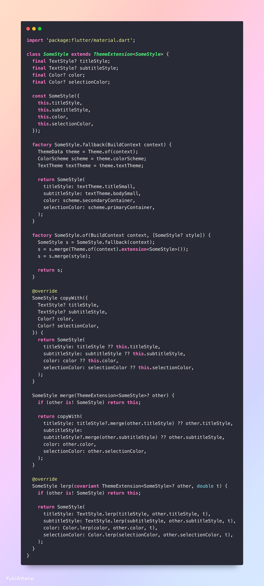
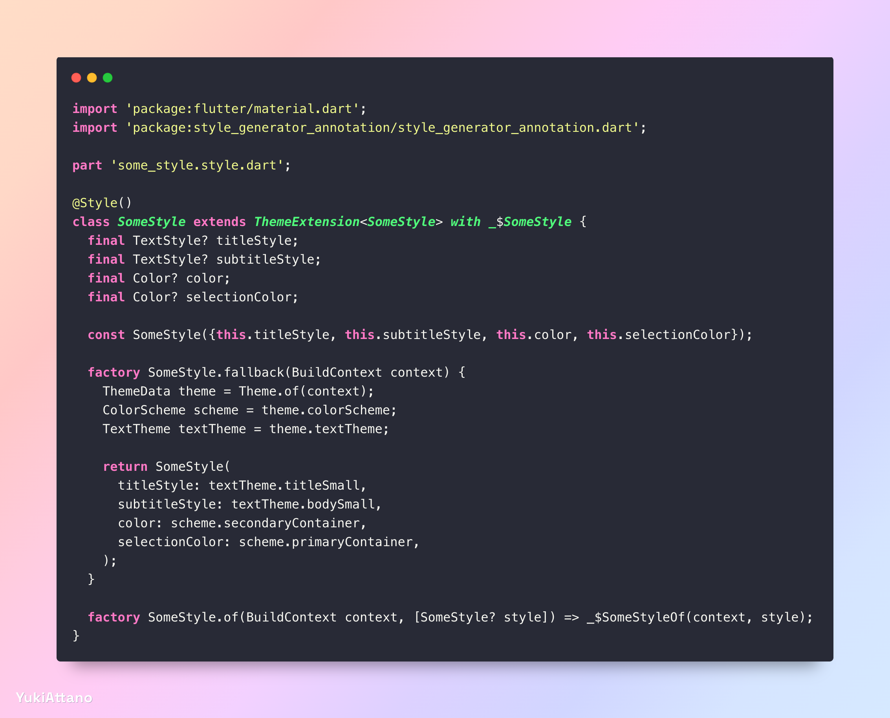

[](https://pub.dev/packages/style_generator)

This package is considered stable and will jump to version 1.0.0 after a testing period.

Generates ThemeExtensions for your Style Classes

| Before                                   | After                                 |
|------------------------------------------|---------------------------------------|
|   |  |

# Getting Started

```shell
dart pub add style_generator_annotation
dart pub add dev:style_generator
dart pub add dev:build_runner
```

## Template Plugin

For even easier generation, use the [Style Generator Templates for Flutter](https://plugins.jetbrains.com/plugin/28833-style-generator-templates-for-flutter) Plugin for Android Studio

# Index

- [Getting Started](#getting-started)
- [Template Plugin](#template-plugin)
- [Index](#index)
- [ThemeExtensions](#themeextensions)
    - [Minimum Example](#minimum-example)
    - [Fallback and of() Constructor](#fallback-and-of-constructor)
    - [Positional and Named Parameter](#positional-and-named-parameter)
- [Annotations](#annotations)
    - [Style](#style)
      - [Customize the default behavior with build.yml](#customize-the-default-behavior-with-buildyml)
    - [StyleKey\<T>](#stylekeyt)
    - [CopyWith](#copywith)
      - [Customize the default behavior with build.yml](#customize-the-default-behavior-with-buildyml-1)
    - [CopyWithKey](#copywithkey)
    - [Custom Lerp Functions](#custom-lerp-functions)
    - [Custom Merge Functions](#custom-merge-functions)
- [Prefixed Imports and static callbacks](#prefixed-imports-and-static-callbacks)
- [Feedback](#feedback)

# ThemeExtensions

## Minimum Example:
```dart
import 'package:flutter/material.dart';
// add import
import 'package:style_generator_annotation/style_generator_annotation.dart';

// add part file: your_file_name.style.dart
part 'some_style.style.dart';

// add Style annotation and Mixin _$YourClass
@Style()
class SomeStyle extends ThemeExtension<SomeStyle> with _$SomeStyle {
  // just add the fields and a constructor to assign them
  final TextStyle? titleStyle;
  final TextStyle? subtitleStyle;

  final Color? color;
  final Color? selectionColor;

  const SomeStyle({this.titleStyle, this.color, this.subtitleStyle, this.selectionColor});
}
```

## Fallback and of() Constructor:

This package supports generating a quick constructor to retrieve your Style from BuildContext.

```dart
import "package:flutter/widgets.dart";

class SomeWidget extends StatelessWidget {
  final SomeStyle? style;

  const SomeWidget({super.key, this.style});

  @override
  Widget build(BuildContext context) {
    // retrieve your custom style from context, backed by your SomeStyle.fallback() design.
    SomeStyle s = SomeStyle.of(context, style);

    return const Placeholder();
  }
}
```

```dart
class SomeStyle extends ThemeExtension<SomeStyle> with _$SomeStyle {
  
  // ... see minimal example at the top
  
  factory SomeStyle.fallback(BuildContext context, {String? something}) {
    ThemeData theme = Theme.of(context);
    ColorScheme scheme = theme.colorScheme;
    TextTheme textTheme = theme.textTheme;

    return SomeStyle(
      titleStyle: textTheme.titleSmall,
      subtitleStyle: textTheme.bodySmall,
      color: scheme.secondaryContainer,
      selectionColor: scheme.primaryContainer,
    );
  }

  // add YourClass.of(BuildContext context) as a factory constructor
  factory SomeStyle.of(BuildContext context, [SomeStyle? style]) => _$SomeStyleOf(context, style);

  // That will generate this method
  SomeStyle _$SomeStyleOf(BuildContext context, [SomeStyle? style]) {
    SomeStyle s = SomeStyle.fallback(context);
    s = s.merge(Theme.of(context).extension<SomeStyle>());
    s = s.merge(style);

    return s;
  }
}
```

## Positional and Named Parameter

<details>
<summary> A mix of positional and named parameter are supported. </summary>

```dart
@Style()
class SomeStyle extends ThemeExtension<SomeStyle> with _$SomeStyle {

  final TextStyle? titleStyle;
  final TextStyle? subtitleStyle;

  final Color? color;
  final Color? selectionColor;

  const SomeStyle(this.titleStyle, this.color, {this.subtitleStyle, this.selectionColor});
}
```

Additionally non-nullable parameter and typed parameter are also supported.

```dart
@Style()
class SomeStyle extends ThemeExtension<SomeStyle> with _$SomeStyle {
  final TextStyle titleStyle;
  final TextStyle subtitleStyle;

  // Types that have a lerp function, whether static or not are used for lerp() automatically.
  // Here, the lerp() method from Some<T, K> will be used.
  final Some<Color, double>? color;
  final Color? selectionColor;

  const SomeStyle(this.titleStyle, this.color, {required this.subtitleStyle, this.selectionColor});
}

class Some<T, K> {
  final T color;
  final K something;

  const Some(this.color, this.something);

  Some<T, K>? lerp(Some<T, K>? a, Some<T, K>? b, double t) {
    return b;
  }
}
```

</details>

# Annotations

## Style
<details>
<summary> The Style annotation allows customizing the generation of the style class. </summary>
For example, you can disable the `copyWith()` generation and use another package for it.

See the [`Style` annotation](https://github.com/YukiAttano/style_generator/blob/main/style_generator_annotation/lib/src/annotations/style.dart) documentation for more info. 

```dart
@Style(constructor: "_", fallback: "custom", genCopyWith: true, genMerge: true, genLerp: true, genOf: true, suffix: "Generated")
class SomeStyle extends ThemeExtension<SomeStyle> with _$SomeStyleGenerated {
  final TextStyle titleStyle;
  final TextStyle subtitleStyle;

  // lerp method from Some<T, K> will be used
  final Some<Color, double>? color;
  final Color? selectionColor;

  const SomeStyle(this.titleStyle, this.color, {required this.subtitleStyle, this.selectionColor});
  
  factory SomeStyle.of(BuildContext context, [SomeStyle? style]) => _$SomeStyleGeneratedOf(context, style);
}

```
</details>

### Customize the default behavior with build.yml

You can customize the default behavior in your build.yml

```yaml
targets:
  $default:
    builders:
      style_generator|style_builder:
        enabled: true
        options:
          constructor: null     # The constructor for .copyWith and .lerp to use. The default is `null`
          fallback: "fallback"  # The constructor for .of to use,        The default is `null`
          gen_copy_with: true   # whether .copyWith should be generated. The default is `true`
          gen_merge: true       # whether .merge    should be generated. The default is `true`
          gen_lerp: true        # whether .lerp     should be generated. The default is `true`
          gen_of: null          # whether .of       should be generated. The default is `null` (will only generate if the fallback constructor and a factory .of() constructor is found)
          suffix: null          # an optional suffix for the generated mixin and .of method. The default is `null`
```

## StyleKey\<T>

<details>

<summary> Every field and constructor parameter can be further configured with @StyleKey&lt;T>() </summary>

```dart
@Style()
class SomeStyle extends ThemeExtension<SomeStyle> with _$SomeStyle {
 
  final TextStyle? titleStyle;
  final TextStyle? subtitleStyle;

  @StyleKey(inCopyWith: false, inLerp: false, inMerge: false)
  final Color? color;
  final Color? selectionColor;

  const SomeStyle({
    this.titleStyle, 
    this.color, 
    this.subtitleStyle,
    @StyleKey(inCopyWith: false, inLerp: false, inMerge: false)
    this.selectionColor,
  });
}
```

Only StyleKeys on fields and the constructor matching Style.constructor are considered.

Do note, StyleKeys on the constructor override configurations on the field without further warning.
</details>

## CopyWith

<details>

<summary> Since a `copyWith()` method is required by a `ThemeExtension`, i've added a `@CopyWith()` annotation 
that generates a standalone `copyWith()` Extension </summary>

```dart
import 'package:style_generator_annotation/copy_with_generator_annotation.dart';

@CopyWith()
class Profile {
  final String firstname;
  final String lastname;

  String get name => "$firstname $lastname";

  final DateTime? birthday;

  int get age => birthday != null ? DateTime.now().difference(birthday!).inDays ~/ 365 : 0;

  const Profile({this.firstname = "", this.lastname = "", this.birthday});
}
```

which generates:
```dart
import 'package:test_generation/src/data/profile.dart';

extension $ProfileExtension on Profile {
  Profile copyWith({
    String? firstname,
    String? lastname,
    DateTime? birthday,
  }) {
    return Profile.new(
      firstname: firstname ?? this.firstname,
      lastname: lastname ?? this.lastname,
      birthday: birthday ?? this.birthday,
    );
  }
}
```

</details>

### Customize the default behavior with build.yml

You can customize the default behavior in your build.yml

```yaml
targets:
  $default:
    builders:
      style_generator|copy_with_builder:
        enabled: true
        options:
          constructor: null     # The constructor for .copyWith to use. The default is `null`
          asExtension: null     # whether an Extension method or a mixin should be generated. The default is `null` (will generate an Extension)
          suffix: null          # an optional suffix for the generated extension or mixin. The default is `null`
```

## CopyWithKey

The generation of the `copyWith()` method can be further customized

a more complex example: 
```dart
import 'package:style_generator_annotation/copy_with_generator_annotation.dart';
import 'package:test_generation/src/question_style.dart';
import '../fake.dart' as fake;

class Profile {
  final String firstname;
  @CopyWithKey(inCopyWith: false) // this will hide lastname in subclasses too
  final String lastname;

  String get name => "$firstname $lastname";

  final DateTime? birthday;

  int get age => birthday != null ? DateTime.now().difference(birthday!).inDays ~/ 365 : 0;

  const Profile({
    @CopyWithKey(inCopyWith: false) this.firstname = "", // this will hide firstname only it its own class
    this.lastname = "", 
    this.birthday,
  });
}


class UserProfile extends Profile {
  final String id;

  final String firstName; // don't get confused with 'firstName' and 'firstname'

  final fake.TextStyle? style;
  final QuestionStyle? question;

  UserProfile({
    this.id = "", 
    this.firstName = "", 
    super.lastname, // this is hidden through its super class, annotate it in the constructor with @CopyWithKey(inCopyWith: true) to override the behavior
    this.style, 
    this.question, 
    super.birthday, 
    super.firstname,
  });
}
```

The generated code adds all necessary imports and comments out what is not included in your `copyWith()`
```dart
import 'dart:core';
import 'package:test_generation/src/fake.dart' as fake;
import 'package:test_generation/src/question_style.dart';
import 'package:test_generation/src/data/profile.dart';

extension $ProfileExtension on Profile {
  Profile copyWith({
    // String? firstname,
    // String? lastname,
    DateTime? birthday,
  }) {
    return Profile.new(
      // firstname: firstname ?? this.firstname,
      // lastname: lastname ?? this.lastname,
      birthday: birthday ?? this.birthday,
    );
  }
}

extension $UserProfileExtension on UserProfile {
  UserProfile copyWith({
    String? id,
    String? firstName,
    fake.TextStyle? style, // prefixed imports are supported
    QuestionStyle? question,
    // String? lastname,
    DateTime? birthday,
    String? firstname,
  }) {
    return UserProfile.new(
      id: id ?? this.id,
      firstName: firstName ?? this.firstName,
      style: style ?? this.style,
      question: question ?? this.question,
      // lastname: lastname ?? this.lastname,
      birthday: birthday ?? this.birthday,
      firstname: firstname ?? this.firstname,
    );
  }
}
```

## Custom Lerp Functions

Sometimes, custom lerp functions are required.

The generator will consider lerpDouble() for integer, double and num fields by default.
It uses a lerpDuration for Darts Duration class.
For all other cases, it searches for a .lerp() method inside the types class and applies that.
If nothing is found, .lerp() will not lerp the field (and a warning is printed).

Other custom typed .lerp() functions can be applied with StyleKeys.
(The custom method must be static or a top level method).

```dart
@Style()
class SomeStyle extends ThemeExtension<SomeStyle> with _$SomeStyle {
 
  final TextStyle? titleStyle;
  final TextStyle? subtitleStyle;

  // The function must match the type of the StyleKey. (Which itself should match the type of the field)
  @StyleKey<WidgetStateProperty<double?>?>(lerp: lerpWidgetStateProperty)
  final WidgetStateProperty<double?>? elevation;
  
  // Here, a custom color lerp function is used
  @StyleKey<Color?>(lerp: customColorLerp)
  final Color? color;
  final Color? selectionColor;

  const SomeStyle({
    this.titleStyle, 
    this.color, 
    this.elevation,
    this.subtitleStyle,
    this.selectionColor,
  });

  static WidgetStateProperty<double?>? lerpWidgetStateProperty(
      WidgetStateProperty<double?>? a,
      WidgetStateProperty<double?>? b,
      double t,
      ) {
    return WidgetStateProperty.lerp<double?>(a, b, t, lerpDouble);
  }
}

Color? customColorLerp(Color? a, Color? b, double t) => b;
```

## Custom Merge Functions

Sometimes, like i guess never, custom merge functions are required.

For example, if you don't want to apply the default merge() behavior of a TextStyle.

(The custom method must be static or a top level method).

```dart
@Style()
class SomeStyle extends ThemeExtension<SomeStyle> with _$SomeStyle {
 
  // The function must match the type of the StyleKey. (Which itself should match the type of the field)
  @StyleKey<TextStyle?>(merge: noMerge)
  final TextStyle? titleStyle;
  final TextStyle? subtitleStyle;

  final Color? color;
  final Color? selectionColor;

  const SomeStyle({
    this.titleStyle, 
    this.color, 
    this.subtitleStyle,
    this.selectionColor,
  });
}
```

# Prefixed Imports and static callbacks

If you use prefixed imports, one restriction apply.

(1)
If `dart:ui` is imported with a prefix (e.g. `import 'dart:ui' as ui`)
AND you use the Dart-Core data types `int`, `num` or `double`, 
automatically lerping them fails (because `lerpDouble` is not found).
Consider adding a top level function `lerpDouble` (like in the example below) 
or apply a `StyleKey(lerp: ...)` manually.

(2)
Otherwise, all weird combinations should work (if not, the generator will tell you). 

(3)
If you use static Callbacks, always write their full scope.


```dart
import 'dart:ui' as ui; // <-- prefixed import
import 'dart:core' as core; // <-- prefixed import

import 'package:flutter/material.dart';
import 'package:style_generator_annotation/style_generator_annotation.dart';

part 'some_style.style.dart';

const lerpDouble = ui.lerpDouble; // <-- explained above in (1)

@Style()
class SomeStyle extends ThemeExtension<SomeStyle> with _$SomeStyle {

  final core.Duration? animationDuration;

  final core.double? something; // will use lerpDouble which redirects to ui.lerpDouble

  @StyleKey<core.double?>(lerp: ui.lerpDouble) // <-- alternative explained above in (1)
  final core.double? somewhere;

  @StyleKey<Color?>(lerp: SomeStyle.alwaysRed) //don't write `alwaysRed` only, the mixin won't find it
  final Color? color;

  const SomeStyle({this.animationDuration, this.something, this.somewhere, this.color});

  static Color? alwaysRed(Color? a, Color? b, core.double t) => Colors.red;

}
```

# Feedback

Any feedback is welcome :)